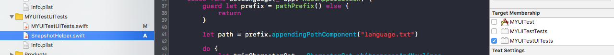
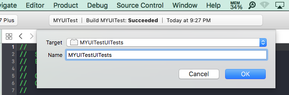
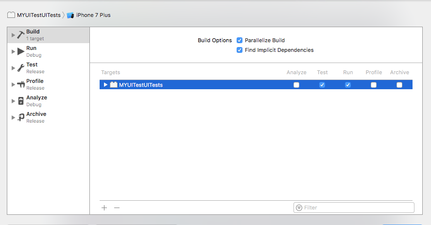
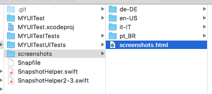
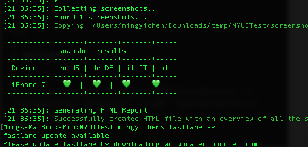
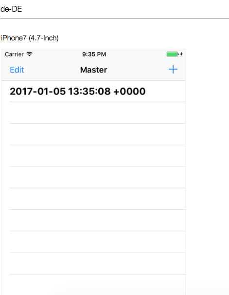

# 前言
* APP 测试，是一件繁琐的事情，没有一个完整的测试用例，测试用例包括功能、系统版本号、Device机种。为了达到功能涵盖完整性自动化是必要性的。
* 之前有用过 appium，但是 macOS 系统和 XCode 升级后，遇到很多问题（虽然网络上有很多解法，但是很麻烦，需要 try again）。用第三方就会有软件时效性的问题，无法即时更新。所以找XCode 的解决方案。
* 由于 Instruments' Automation support has been replaced by Xcode's UI Testing infrastructure. [引用](https://forums.developer.apple.com/thread/48936)
* 功能就以 UITest 来做自动化测试。自动化测试最重要的环节就是每步骤都需要走到，确保每个环节都有就是截屏幕。找到 [fastlane](https://github.com/fastlane/fastlane)
* 里面其中的 [snapshot](https://github.com/fastlane/fastlane/tree/master/snapshot)
* 步骤很简单

## 安装
* 我是以 Installer Script的方式安装。确保有无安装命令行如下：

~~~
 fastlane -version
~~~

## 使用步骤
* create project ，目前使以 swift 的小范例(Objective-c有些问题，尚待解决)。选取 建立 UITest target 
* [怎么录制脚本](https://onevcat.com/2015/09/ui-testing/)
* 在该 project 路径下执行如下命令行

~~~
fastlane snapshot init
~~~

* 会有多出三个档案Snapfile、SnapshotHelper.swift、SnapshotHelper2-3.swift

* 将 SnapshotHelper.swift 放入 project ，且 target 记得要勾选 UITest target
	

* MYUITestUITests，setUp()加入代码

~~~
override func setUp() {
    super.setUp()             
    XCUIApplication().launch()
         
    //加入以下三行
    let app = XCUIApplication()
    setupSnapshot(app)
    app.launch()
}
~~~

* testExample 加入 代码	

~~~
 func testExample() {
        
       // 此为动作XCUIApplication().navigationBars["Master"].buttons["Add"].tap()
		//截屏幕
        snapshot("0Launch")
    }
~~~	

* XCode -> Project -> schema -> new schema 

* XCode -> Project -> edit schema 

* 命令行指令，目前只测试 iphone 7

~~~
fastlane snapshot --scheme "MYUITestUITests" --configuration "Release"  --sdk "iphonesimulator"  --devices "iPhone 7"
~~~

* 结果出现于 screenshots 目录下，如图

* 也可点开路径下的 screenshot.html 看结果

 
